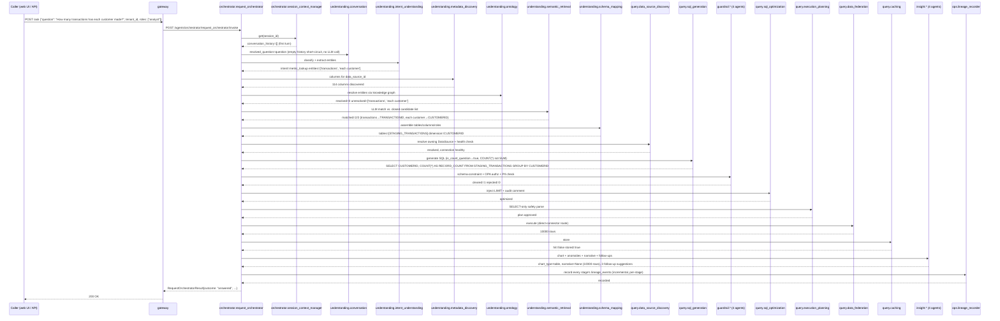

# Data Flow: One Real Request, End to End

This document walks one real question — from the actual 10-question golden
set (`eval/golden_set/gq_002_transaction_count_by_customer.yaml`) — through
the real, live pipeline, naming the real agent responsible for each stage
and a realistic `lineage_events` entry it emits. Updated 2026-08-01; the
previous version of this document used a fictional "churn rate" example and
invented per-stage lineage event names (`request_received`,
`intent_extracted`, etc.) that don't exist in the real `LineageEvent`
contract — see `packages/shared/navigraph_shared/contracts/agent_io.py`.
The real `LineageEvent` shape is just `{event_id, agent_name, timestamp,
input_summary, output_summary, tenant_id, trace_id}` — there is no separate
"event type" field; the agent's own dotted name (e.g.
`understanding.intent_understanding`) is the real, stable identity of each
step.

Example question used throughout, real and golden-set-verified: **"How many
transactions has each customer made?"** (`gq_002`, `expected_intent:
metric_lookup`, `expected_columns: [CUSTOMERID]`).

## Real sequence

## Stage-by-stage detail

### 1. Gateway receives the request

`gateway` (`packages/gateway`) receives `POST /ask`, builds a
`RequestContext` (`tenant_id`, `user_id`, `trace_id`, `roles`, `claims`),
and forwards to `agent-runtime`'s
`POST /agents/orchestrator/request_orchestrator/invoke` over a real HTTP
hop (gateway and agent-runtime are separate containers — see
`system-architecture.md`). `roles`/`claims` are caller-supplied and not yet
cryptographically verified (`LIMITATIONS.md` item 23).

### 2. Session + Conversation

`orchestrator.session_context_manager` fetches (or mints) the real Redis
session and its `conversation_history`. `understanding.conversation`
short-circuits with no LLM call on an empty history (this being a first
turn); a follow-up question on a non-empty history would get one real LLM
rewrite call here instead.

### 3. Understanding domain

`understanding.intent_understanding` classifies the question as
`metric_lookup` and extracts `["transactions", "each customer"]` as
entities — confirmed via a real direct call to this agent this session
(`lineage_events[0].output_summary = "intent=metric_lookup
entities=['transactions', 'each customer']"`). `understanding.metadata_discovery`
independently returns the real 114-column catalog inventory for this
tenant's one registered Snowflake data source.
`understanding.ontology` attempts a free, zero-hallucination match against
the real Neo4j knowledge graph's `BusinessConcept` nodes — for this
particular question, neither entity resolved this way (confirmed live:
`"resolved=0 unresolved=['transactions', 'each customer']"`), so both fall
through to `understanding.semantic_retrieval`, which makes one real,
closed-candidate-list LLM call and matches both (`"transactions"` →
`TRANSACTIONID`, `"each customer"` → `CUSTOMERID`, both on
`STAGING_TRANSACTIONS`). `understanding.schema_mapping` assembles the
final mapping: one table, one dimension column (`CUSTOMERID`).

### 4. Query domain (generation half)

`query.data_source_discovery` resolves the real Snowflake `DataSource` that
owns `STAGING_TRANSACTIONS` and confirms live connectivity.
`query.sql_generation` builds the real SQL — this exact question is the one
that originally exposed the real SUM-vs-COUNT aggregation bug
(`LIMITATIONS.md` item 38, fixed as item 73): `_is_count_question` matches
the phrase "how many" here, so the generated SQL uses `COUNT(*) AS
RECORD_COUNT`, never `SUM`, even though `TRANSACTIONID` was matched to a
numeric-looking column.

### 5. Guardrail domain

`guardrail.schema_constraint_validator` confirms `STAGING_TRANSACTIONS` and
`CUSTOMERID` are real, current catalog entries.
`guardrail.policy_authorization` makes a real `POST` to OPA's
`navigraph/authz/decision` endpoint — the `analyst` role and matching
`tenant_id`/`claims.tenant_id` pass. `guardrail.pii_exposure_checker`
confirms `CUSTOMERID` is not tagged `is_pii` for this tenant, so the
statement clears (a *different* golden question asking about
`RISKLEVEL` — a real tagged PII column — would be denied here instead;
see `security-compliance.md`).

### 6. Query domain (execution half)

`query.sql_optimization` injects a `LIMIT` and the real audit-trace SQL
comment. `query.execution_planning` re-parses the SQL to confirm it's a
single, SELECT-only statement. `query.data_federation` executes it for
real against Snowflake via the `direct_connector` route (the default —
Trino is registered but not the default execution path;
`DECISIONS.md`'s Phase 5 entry) and returns the real result set (10,000
rows for this tenant's real data). `query.caching` stores the result under
a tenant-prefixed, versioned Redis key.

### 7. Insight domain

`insight.chart_selection` picks `table` (no clean single measure/dimension
pair for a 10,000-row per-customer breakdown). `insight.anomaly_outlier_highlighter`
runs its z-score check. `insight.grounded_narrative_generation` may return
an empty narrative for a result this large (a real, current limitation —
see `LIMITATIONS.md`'s narrative-grounding notes). `insight.follow_up_suggestion`
proposes real next questions — confirmed live via the actual chat UI:
*"Who are the top 20 customers by transaction count?"*, *"What is the
distribution of transaction counts across all customers (e.g., one-time vs.
repeat buyers)?"*, *"How does each customer's transaction count trend over
time (monthly or quarterly)?"*

### 8. Lineage recorded, response returned

`ops.lineage_recorder` persists every upstream agent's real
`lineage_events` incrementally (one call per agent's output, not one
end-of-request batch), idempotently keyed on each event's real `event_id`.
The full trace is queryable afterward via `GET /lineage/{trace_id}?tenant_id=...`.
`gateway` returns the real `RequestOrchestratorResult` — `outcome:
"answered"`, the real columns/rows, chart spec, narrative, and follow-up
suggestions — to the caller.
