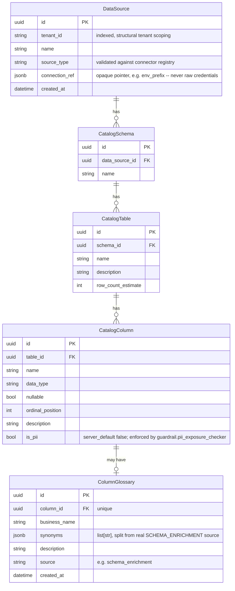
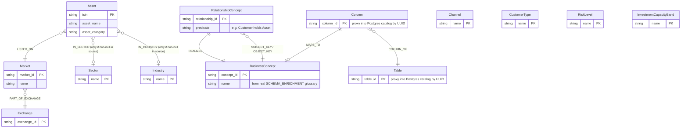
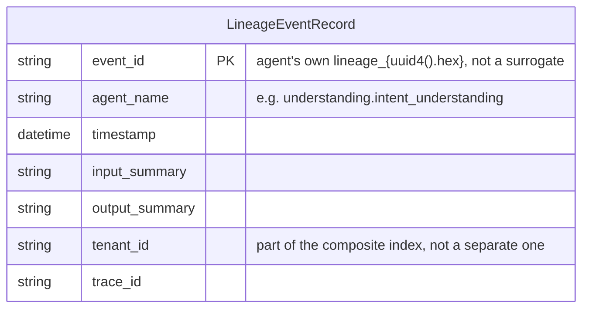

# Data Model

The real schemas behind the three storage layers: the Postgres metadata
catalog, the Neo4j knowledge graph, and the Postgres lineage store.
Pulled directly from the real SQLAlchemy models/migrations and Cypher
ontology constants — not re-derived or approximated.

## Metadata catalog (Postgres, `packages/metadata_catalog`)

Structural schema/glossary/PII-tag storage only — no business ontology,
no raw row data. `tenant_id` lives on `DataSource` so tenant scoping is
structural from the root of the tree.

Real, honest gaps: `connection_ref` is deliberately opaque (real secrets
come from Key Vault, never stored here); only ~30 of the real columns
have a `ColumnGlossary` entry — a column without one legitimately has "no
business concept exists yet," never a synthesized fallback.

## Knowledge graph (Neo4j, `packages/knowledge_graph`)

Two-tier by design (`DECISIONS.md`'s Phase 3 entry): bounded-cardinality
reference/dimension nodes, plus a thin business-concept mapping layer.
Customers and transactions are deliberately **excluded** — high-
cardinality, high-write facts stay in Snowflake/SQL; the graph only
supplies reference-data validation and business-term resolution.

Real node/relationship label constants (`ontology.py`): 9 reference-data
node labels (`Asset`, `Market`, `Exchange`, `Sector`, `Industry`,
`Channel`, `CustomerType`, `RiskLevel`, `InvestmentCapacityBand`) + 4
business-concept-layer labels (`BusinessConcept`, `Table`, `Column`,
`RelationshipConcept`), and 9 relationship types (`LISTED_ON`,
`PART_OF_EXCHANGE`, `IN_SECTOR`, `IN_INDUSTRY`, `MAPS_TO`, `COLUMN_OF`,
`REALIZES`, `SUBJECT_KEY`, `OBJECT_KEY`).

Real, confirmed-live data-shape findings that drove this design
(`DECISIONS.md`'s Phase 3 entry): exchanges and markets are genuinely
1-to-many (e.g. `ATHEX` groups 3 real markets); Sector/Industry are
independent siblings, not a strict hierarchy (one real violation found —
`"Building Materials"` under two different parents); only ~50% of assets
have any sector/industry at all (bonds/funds legitimately have none).
Soft staleness (`active`/`last_synced_at` flags), not hard deletes, on
re-ingestion.

## Lineage store (Postgres, `packages/lineage`, own Alembic chain)

One table, storing exactly the fields the shared `LineageEvent` contract
already defines — no separate "event type" field; `agent_name` (e.g.
`understanding.intent_understanding`) is the real, stable identity of
each recorded step.

`event_id` as the real primary key makes idempotent re-insertion a real,
DB-enforced property (`INSERT ... ON CONFLICT (event_id) DO NOTHING`),
not just an application convention — proven by a real re-recording test
in `tests/integration/lineage_pipeline/`. The composite index
`(tenant_id, trace_id, timestamp)` matches the one real read pattern:
"give me the whole ordered chain for this tenant+trace" (`GET
/lineage/{trace_id}?tenant_id=...`).

Reused the same physical Postgres instance as `metadata_catalog`, with
its own `alembic_version_lineage` tracking table to avoid colliding with
the catalog's own `alembic_version` — no new database service, since
tenant isolation in this codebase is already row-level everywhere, never
database-level.
