# Architecture Overview

This document is the canonical map of the NaviGraph agent architecture: the
request lifecycle, the six agent domains, and the 25 real, built agents
within them. Updated 2026-08-01 against the actual repository state (see
`BUILD_LOG.md` for the phase-by-phase build history and `LIMITATIONS.md`
item 32 for why this document had gone stale before this pass).

## What NaviGraph does

NaviGraph answers natural-language business questions by combining
schema-grounded SQL generation with knowledge-graph semantic reasoning, for a
real tenant querying a real Snowflake brokerage/wealth-platform dataset,
under real RBAC/PII guardrails, with every stage's output recorded to a
real, queryable lineage trail.

## Request lifecycle

Every one of the 25 agents below is invoked, in this order, by the
**Request Orchestrator** (`orchestrator.request_orchestrator`) — a plain
Python async function, not a LangGraph graph (Phase 1's original LangGraph
decision was explicitly reversed in Phase 9; see `DECISIONS.md`'s
2026-07-29 "No LangGraph" entry). Every stage's `lineage_events` are
recorded via `ops.lineage_recorder` immediately after that stage completes
(see [`data-flow.md`](./data-flow.md) for the exact event-by-event
walkthrough of one real question).

```mermaid
flowchart TD
    Q[NL question + session_id?] --> Conv

    subgraph U["Understanding domain"]
        Conv["Conversation<br/>(resolve follow-up, or short-circuit)"] --> Intent["Intent Understanding<br/>(classify IntentLabel + extract entities)"]
        Intent --> MD["Metadata Discovery<br/>(catalog columns + glossary for data_source_id)"]
        MD --> Ont["Ontology<br/>(KG business-term/relationship match, zero-hallucination)"]
        Ont --> SR["Semantic Retrieval<br/>(LLM match vs. closed candidate list, for terms Ontology missed)"]
        SR --> SM["Schema Mapping<br/>(assemble tables/columns/joins, assign measure/dimension roles)"]
    end

    subgraph Q2["Query domain"]
        SM --> DSD["Data Source Discovery<br/>(resolve owning DataSource + live connectivity check)"]
        DSD --> SG["SQL Generation<br/>(deterministic builder + LLM predicate resolution)"]
    end

    subgraph G["Guardrail domain"]
        SG --> SCV["Schema Constraint Validator<br/>(verify referenced tables/columns are real)"]
        SCV --> PA["Policy Authorization<br/>(real OPA RBAC/ABAC decision)"]
        PA --> PII["PII Exposure Checker<br/>(deny unauthorized roles on tagged PII columns)"]
    end

    subgraph Q3["Query domain (cont.)"]
        PII --> SO["SQL Optimization<br/>(inject LIMIT, audit-trace comment)"]
    end

    subgraph G2["Guardrail domain (cont.)"]
        SO --> QCE["Query Cost/Row-Limit Estimator<br/>(per-role row cap)"]
    end

    subgraph Q4["Query domain (cont.)"]
        QCE --> EP["Execution Planning<br/>(SELECT-only safety gate, real SQL parse)"]
        EP --> DF["Data Federation<br/>(execute: direct connector or Trino route)"]
        DF --> Cache["Caching<br/>(Redis, tenant-scoped, versioned key)"]
    end

    subgraph I["Insight domain"]
        Cache --> CS["Chart Selection<br/>(deterministic chart_type/x/y)"]
        CS --> AOH["Anomaly/Outlier Highlighter<br/>(z-score, stdlib only)"]
        AOH --> GNG["Grounded Narrative Generation<br/>(LLM, citations validated against real cells)"]
        GNG --> FUS["Follow-up Suggestion<br/>(LLM, shape-only validated)"]
    end

    FUS --> R[RequestOrchestratorResult]

    classDef domain fill:#1a2540,stroke:#5b8def,color:#e8ecf7
    class U,Q2,G,Q3,G2,Q4,I domain
```

Two branch points not shown as straight-line flow above:

- **Multi-turn Clarification Coordinator** (`orchestrator.clarification_coordinator`)
  triggers when Schema Mapping resolves zero tables (`tables == []`) —
  the pipeline short-circuits there and returns `outcome:
  "needs_clarification"` with a real LLM-generated clarifying question,
  instead of continuing to Query/Guardrail/Insight.
- **Session/Context Manager** (`orchestrator.session_context_manager`) is
  called by the Request Orchestrator to fetch/append conversation history
  in Redis before Conversation runs, and after the result is produced —
  not part of the main data-flow chain above.

## Agent domains and agents

All 25 agents below are **BUILT** — real implementation, real unit tests
(mocked LLM via `FakeLLMClient`), wired into `agent_runtime`'s
`main.py`, and exercised by at least one real
`tests/integration/*_pipeline/` chain test against live infrastructure.

### Understanding domain (6 agents)

Turns a raw natural-language question into structured intent, resolved
entities, and a fully mapped schema/join plan.

| Agent (`AGENT_NAME`) | Real job |
|---|---|
| `understanding.conversation` | Rewrites a follow-up question using `conversation_history`; empty history short-circuits with no LLM call |
| `understanding.intent_understanding` | Classifies the question into one of 4 real `IntentLabel` values (`metric_lookup`/`comparison`/`trend_analysis`/`anomaly_investigation`) and extracts entities |
| `understanding.metadata_discovery` | Pure catalog read: returns every column (+ glossary business name/synonyms) for a `data_source_id`, no LLM |
| `understanding.ontology` | Resolves entities against the real Neo4j knowledge graph's `BusinessConcept`/`RelationshipConcept` nodes — zero-hallucination, no LLM |
| `understanding.semantic_retrieval` | LLM match of whatever Ontology couldn't resolve, against a **closed** candidate list of real catalog columns — every returned ID is validated, never trusted blind |
| `understanding.schema_mapping` | Assembles Ontology's + Semantic Retrieval's resolutions into final tables/columns/joins, assigning each column a `measure`/`dimension` role |

### Query domain (6 agents)

Turns a mapped schema into a real, executed, safely-bounded result set.

| Agent (`AGENT_NAME`) | Real job |
|---|---|
| `query.data_source_discovery` | Resolves which real `DataSource` owns each mapped table + a live `test_connection()` health check |
| `query.sql_generation` | Deterministic SELECT/FROM/JOIN/GROUP BY builder; one small LLM call only for natural-language predicate resolution (relative dates, free-text filters), skipped when not needed |
| `query.sql_optimization` | Rule-based: injects `LIMIT` if absent, adds a `trace_id`/`tenant_id` audit comment, no LLM |
| `query.execution_planning` | The hard safety gate — real SQL parsing verifies single-statement/SELECT-only before anything can execute |
| `query.data_federation` | The one agent that actually executes — direct-connector route (default) or Trino route |
| `query.caching` | Redis-backed, tenant-prefixed, versioned cache key over post-optimization SQL |

### Guardrail domain (4 agents)

Sits between SQL Generation and Execution Planning (placement follows data
availability, not a fixed table position — see `DECISIONS.md`'s Phase 6
entry). Enforces real RBAC/ABAC/PII/cost policy before any SQL executes.

| Agent (`AGENT_NAME`) | Real job |
|---|---|
| `guardrail.schema_constraint_validator` | Verifies every referenced table/column genuinely exists in the catalog for the statement's `data_source_id` |
| `guardrail.policy_authorization` | Real `POST` to OPA's `navigraph/authz/decision` endpoint — fails closed if OPA is unreachable |
| `guardrail.query_cost_estimator` | Per-role row-limit enforcement against `OptimizedSql.estimated_row_count` |
| `guardrail.pii_exposure_checker` | Denies any statement referencing an `is_pii=true` column unless the caller's role is in `PII_AUTHORIZED_ROLES` |

### Insight domain (4 agents)

Turns a real result set into a chart, a grounded explanation, detected
anomalies, and next-step suggestions.

| Agent (`AGENT_NAME`) | Real job |
|---|---|
| `insight.chart_selection` | Deterministic `bar`/`line`/`table`/`single_value` selection from column roles — no LLM |
| `insight.anomaly_outlier_highlighter` | Z-score anomaly detection via stdlib `statistics` only — no LLM, no new dependency |
| `insight.grounded_narrative_generation` | LLM narrative generation; every citation validated against real `(row_index, column, value)` triples, fabricated citations dropped |
| `insight.follow_up_suggestion` | LLM-generated next-question suggestions; shape-only validated (a suggestion is a proposal, not a factual claim) |

### Ops domain (2 agents)

| Agent (`AGENT_NAME`) | Real job |
|---|---|
| `ops.lineage_recorder` | Persists every upstream agent's `lineage_events` to Postgres, idempotently (`event_id` as primary key), own package/migration chain |
| `ops.evaluation_judge` | LLM-as-judge scoring (`correctness`/`groundedness`/`narrative_quality`) for the eval harness; `intent_match` is a plain Python equality check, never delegated to the LLM |

### Orchestrator domain (3 agents)

| Agent (`AGENT_NAME`) | Real job |
|---|---|
| `orchestrator.request_orchestrator` | The one real entry point — calls all 22 agents above in sequence, resolves `data_source_id` when omitted, threads lineage recording throughout |
| `orchestrator.session_context_manager` | Redis-backed conversation history (`ConversationTurn[]`), 1800s sliding TTL |
| `orchestrator.clarification_coordinator` | Triggers on exactly one condition — `schema_mapping.tables == []` — with a real LLM-generated clarifying question |

## Known, honestly-logged gaps in this architecture

Not exhaustive — see `LIMITATIONS.md` for the full, numbered list (80
items as of this writing). The most architecturally significant:

- No Azure AD JWT verification yet — `roles`/`claims` are caller-supplied,
  not cryptographically verified (item 23).
- Ontology's relationship-concept matching accepts low recall in v1
  (item 15).
- Chart Selection's `result_alias` threading gap between SQL Generation
  and Chart Selection is manual, not structural (item 28).
- No real checkpointing/resumability for a mid-pipeline crash (item 41).
