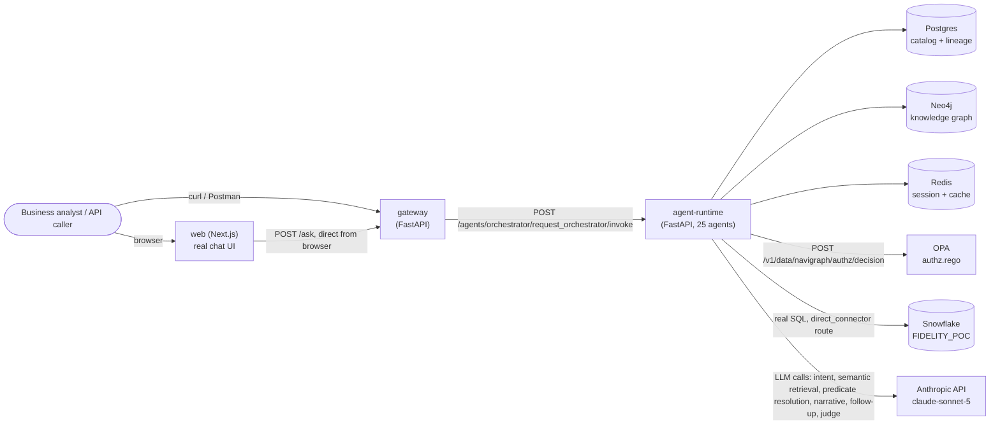
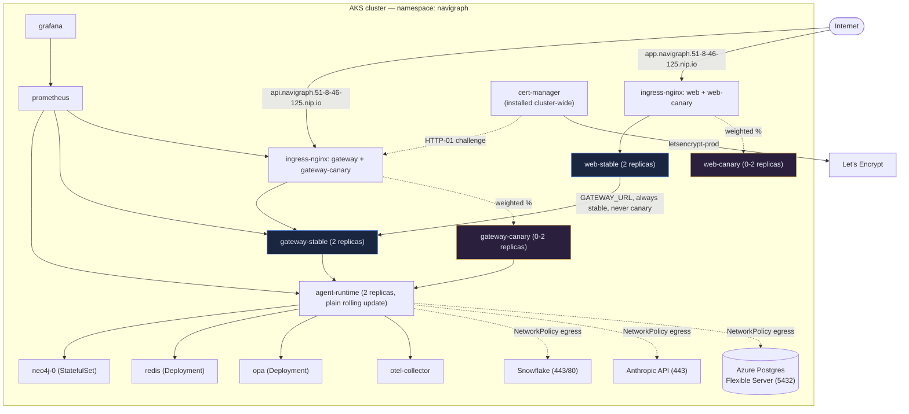
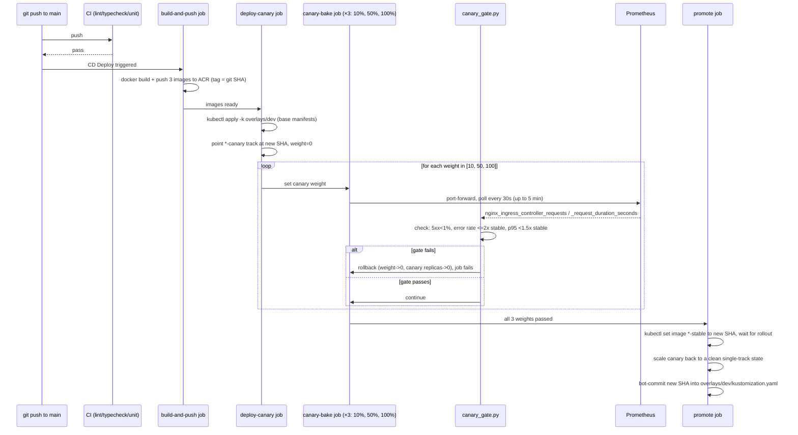

# System Architecture

Deep technical architecture reference — deployment topology, tech stack,
and the canary rollout mechanism. For the agent-level request lifecycle,
see [`overview.md`](./overview.md); for the data/schema model, see
[`data-model.md`](./data-model.md).

## Tech stack (rationale summarized; see `DECISIONS.md` for full reasoning)

| Layer | Choice | Why (one line — full rationale in `DECISIONS.md`) |
|---|---|---|
| Agent runtime | Python 3.12, FastAPI, Pydantic v2 | Mature LLM/data/warehouse-client ecosystem (`docs/adr/0001`) |
| Orchestration | Plain async Python function | LangGraph reversed in Phase 9 — never needed graph checkpointing across 8 phases |
| Gateway | FastAPI (same language as runtime) | Shares Pydantic contracts; proxies to agent-runtime over real HTTP |
| Web UI | Next.js (App Router) | Server + client components; real chat UI calls gateway directly from the browser |
| Metadata catalog | Postgres + SQLAlchemy 2 + Alembic | Structural schema/glossary/PII-tag storage, tenant-scoped |
| Knowledge graph | Neo4j Community | Two-tier reference-data + business-concept graph (see `data-model.md`) |
| Session/cache | Redis | Short-lived, TTL-bounded by nature — no reason for a permanent store |
| Federation | Trino (registered, not default route) | Proven early; `direct_connector` stays default until a 2nd source creates real federation need |
| Policy engine | OPA (real `authz.rego`) | RBAC/ABAC only; PII enforcement is separate Python (not routed through Rego) |
| IaC | Terraform (applied for real) | AKS, ACR, Key Vault, Postgres Flexible Server, networking, Entra app registration |
| K8s manifests | Kustomize (`kubectl apply -k`) | No new tooling surface vs. Helm/ArgoCD |
| CD | Push-based GitHub Actions workflow | No new cluster-side operational surface vs. a real GitOps controller |

## System context

## Deployment topology (real, live AKS)

Key real design points:

- **Only `gateway` and `web` get a canary track.** `agent-runtime` and
  every data store/OPA/observability component is plain rolling-update,
  internal-only — no external traffic ever hits them directly.
- **`web`'s server-side `GATEWAY_URL` always points at `gateway-stable`**,
  never canary — an in-flight gateway canary rollout must never risk
  breaking SSR page renders for users who didn't opt in via a direct
  browser call. Only `NEXT_PUBLIC_GATEWAY_URL` (the browser-side URL, set
  as a real Deployment env var on both tracks — see `LIMITATIONS.md`
  item 78) sees canary-weighted traffic.
- **`NetworkPolicy` is default-deny-all**, with explicit allow-rules
  layered on top per real, necessary traffic path (`infra/k8s/base/networkpolicy-*.yaml`)
  — this exact model has caught 3 real bugs this project (gateway↔agent-runtime
  egress gap, cert-manager's HTTP-01 solver pods, each logged in
  `LIMITATIONS.md`).
- **TLS is real and browser-trusted**: `cert-manager` + `letsencrypt-prod`,
  promoted from `letsencrypt-staging` only after a real staged
  verification (`DECISIONS.md`'s cert promotion entry).

## Canary rollout mechanics

Real, documented failure modes of this exact mechanism (all in
`LIMITATIONS.md`, all with real fixes on record):

- The `promote` job's bot-commit can race a concurrent CD run's own
  bot-commit, either as a clean-rebase conflict (fixed with a bounded
  retry-and-rebase loop) or a genuine same-line merge conflict when two
  promotions land on the same field (no auto-resolution possible —
  requires a manual correction to match the confirmed-live cluster
  state; happened twice, see items 72/76).
- `canary_gate.py`'s checks are the same three metrics regardless of
  10%/50%/100% weight — a real, deliberate simplification, not a bug.

## Secrets and identity

- **Azure Key Vault Provider for Secrets Store CSI Driver** syncs named
  secrets into one shared `navigraph-app-secrets` K8s `Secret` per
  namespace — never plaintext K8s secrets checked into git.
- **Known, accepted gap**: one shared AKS addon identity, not per-pod
  Azure Workload Identity federation — real isolation is which secret
  names each `SecretProviderClass` declares, not a hard per-pod identity
  wall (tested explicitly by `tests/security/cloud/test_secret_provider_scoping.py`).
- **Known, accepted gap**: no AAD-integrated Kubernetes RBAC in `dev` —
  anyone with a kubeconfig is effectively cluster-admin (tested
  explicitly by `tests/security/cloud/test_rbac_least_privilege.py`).

See [`security-compliance.md`](../security/security-compliance.md) for
the full controls mapping.
