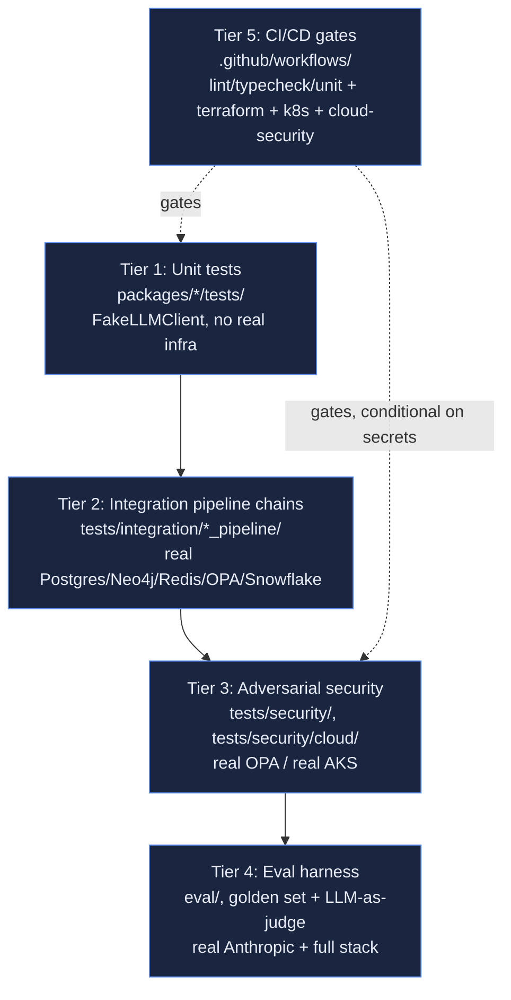

# Test Strategy

The real, as-built test pyramid — five tiers, each with a distinct real
purpose, distinct real infra requirement, and distinct real CI wiring
(or deliberate lack of it). This consolidates what's otherwise scattered
across `eval/README.md` and `tests/security/README.md` into one coherent
narrative; those two files remain the detailed reference for their tier.

## Tier 1: Unit tests (`packages/*/tests/`)

Every one of the 25 agents, plus every library package
(`connector_sdk`, `metadata_catalog`, `knowledge_graph`, `federation`,
`lineage`, `shared`), has its own unit tests. The one universal
convention: **`FakeLLMClient` by default** — every LLM-backed agent's
tests construct a canned or callable-driven fake response, so the full
unit suite needs zero network access and zero API key. A small number of
tests are marked `@pytest.mark.llm_integration` and make one real call to
the real Anthropic API — these are skipped by default, run explicitly
when a real key is available.

Run: `pytest packages/` (this is exactly what `ci.yml` runs on every PR
— see Tier 5).

## Tier 2: Integration pipeline chains (`tests/integration/`)

One subdirectory per domain chain
(`understanding_pipeline`/`query_pipeline`/`guardrail_pipeline`/
`insight_pipeline`/`orchestrator_pipeline`, plus
`metadata_catalog`/`knowledge_graph`/`lineage_pipeline` for the
supporting data layers) — each chains several real agents together
against **real** infrastructure (live docker-compose Postgres, Neo4j,
Redis, OPA, and for `query_pipeline`/`insight_pipeline`/
`orchestrator_pipeline`, live Snowflake too). No graceful skip: these
require the real stack to be up. This is the tier that has caught the
most real cross-agent contract mismatches (e.g. the Schema Mapping
join-inference bug, `LIMITATIONS.md` item ~48).

## Tier 3: Adversarial security (`tests/security/`, `tests/security/cloud/`)

Two sub-tiers:

- **`tests/security/`** — 4 real test files against the real, live,
  non-allow-all OPA policy: tenant isolation, fail-closed on bad/missing
  roles, adversarial policy inputs (parametrized malformed cases), and
  PII exposure denial. See `security-compliance.md` for the full mapping
  from each test to the control it proves.
- **`tests/security/cloud/`** — 6 real test files against the live AKS
  cluster: NetworkPolicy isolation (with a positive control, not just
  isolation-only), secret-provider scoping, RBAC least-privilege, AKS API
  server exposure, ACR privacy, ingress TLS.

Both sub-tiers are **required, not optional** — `tests/security/README.md`'s
own standing rule states a real adversarial test suite is required
before any Guardrail-adjacent work is considered done, not deferred as
"nice to have."

## Tier 4: Evaluation harness (`eval/`)

The real, quantitative "does the whole product actually work" check.
`eval/golden_set/` holds 10 real, schema-grounded questions (see
`prd.md` section 4 for the full functional-requirement mapping to
`IntentLabel` values), each round-tripping the **entire** real pipeline
plus a real Evaluation Judge LLM call scoring `correctness`/
`groundedness`/`narrative_quality` (1-5) — `intent_match` is a plain
Python equality check, never delegated to the judge model.
`eval/run_harness.py` supports `--compare-to` for regression detection: a
≥2-point score drop or any `intent_match` flip is flagged as a hard
regression. Not wired into CI (`eval/README.md` explains why: `ci.yml`
has no Anthropic/Snowflake secrets configured — a deliberate, logged
deferral, not an oversight).

## Tier 5: CI/CD gates (`.github/workflows/`)

| Workflow | What it gates | Runs on |
|---|---|---|
| `ci.yml` | Lint, typecheck, `pytest packages/` (Tier 1 only) | Every PR |
| `security-scan.yml` | `pip-audit`/`npm audit`/`semgrep` (SOC 2 change-management evidence) | Every PR |
| `terraform-plan.yml` | `fmt`+`validate` always; `plan` only if Azure OIDC secrets present | Every PR touching `terraform/` |
| `adversarial-tests.yml` | Tier 3's `tests/security/` (not `cloud/`) | Required check |
| `k8s-manifests-ci.yml` | A real `kind` cluster stand-up + canary-weighting proof, per PR touching `infra/k8s/` | Every PR touching `infra/k8s/**` |
| `cd-deploy.yml` | Real build+push+canary-rollout+promote against the live AKS cluster | Push to `main` |
| `cloud-security-tests.yml` | Tier 3's `tests/security/cloud/` | After a successful `cd-deploy.yml`, gated on real Azure secrets being present |

## What's deliberately not automated

- The eval harness (Tier 4) — needs real, costed API calls; run manually
  or on a deliberate schedule, not per-PR.
- A regression threshold and the judge's 1-5 scale are real placeholders
  pending business validation (`LIMITATIONS.md`), not final calibrated
  values.
